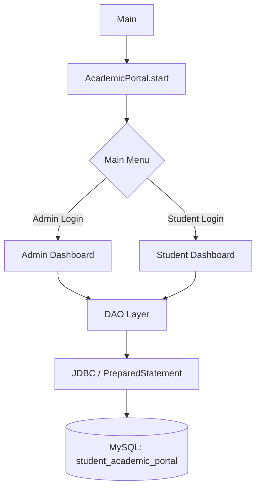

# Student Academic Portal

A console-based academic management application written in Java. It uses Object-Oriented Programming, JDBC, and a MySQL database to manage student records, academic results, and attendance through separate Admin and Student login areas.

> **Note:** This README was written from the project's technical report (class definitions, method signatures, and SQL shown in the documentation), because the source repository itself was not available for direct inspection. Sections that describe confirmed code (classes, methods, SQL, workflow) are accurate to the report. Sections that depend on the actual repo layout (folder structure, build commands, dependency versions, Git URL, license) are marked as **unverified placeholders** — please update them to match your real project before publishing.

## Features

### Admin
- Log in with a username and password, verified against the `admins` table
- Add, search, update, delete, and view all student records
- Add or update a student's marks and view calculated results
- Add or update attendance and view attendance records
- View own admin profile

### Student
- Log in with Roll Number and password
- View personal profile details
- View academic results (grades, grade points)
- View subject-wise attendance and eligibility status
- Log out

### Academic Records
- Store subject code, subject name, credits, marks, and semester per student
- Automatically calculate grade and grade point from marks
- Compute overall CGPA from subject credits and grade points

### Attendance
- Track total classes and attended classes per subject
- Automatically calculate attendance percentage
- Automatically mark status as **Eligible** (≥ 75%) or **Shortage** (< 75%)

## Technologies Used

| Technology | Purpose |
|---|---|
| Java | Core application language; implements all business logic using OOP |
| JDBC | Connects the Java application to the MySQL database and executes SQL |
| MySQL | Stores admin, student, subject, academic record, and attendance data |
| PreparedStatement | Used for parameterized SQL queries instead of string-concatenated SQL |

> **Unverified:** build tool (plain `javac`, Maven, or Gradle) and the exact JDBC driver version are not confirmed — see [Prerequisites](#prerequisites).

## Project Structure

> **Unverified placeholder.** The actual repository layout (package names, subfolders, resource locations) could not be confirmed. The list below is the set of Java classes the project report confirms exist, based on Java's convention that each public class lives in a file of the same name. Replace this tree with your real structure.

```text
Student-Academic-Portal/
├── src/
│   ├── Main.java                 # Application entry point
│   ├── AcademicPortal.java       # Main menu, login routing, admin/student flows
│   ├── Person.java               # Abstract base class (name, phone, email)
│   ├── Student.java              # Student entity (extends Person)
│   ├── StudentDAO.java           # JDBC operations for students
│   ├── Admin.java                # Admin entity (extends Person)
│   ├── AdminDAO.java             # JDBC operations for admins
│   ├── Subject.java              # Subject entity
│   ├── AcademicRecord.java       # Marks, grade, and grade point per subject
│   ├── AcademicDAO.java          # JDBC operations for academic records
│   ├── Attendance.java           # Attendance entity and calculations
│   ├── AttendanceDAO.java        # JDBC operations for attendance
│   ├── DBConnection.java         # Central JDBC connection factory
│   └── DatabaseInitializer.java  # Creates the database, tables, and default admin
├── README.md
└── ...                            # (build files, if any — see note above)
```

- **`Main.java`** — contains `main()`, which starts the application via `AcademicPortal`.
- **`AcademicPortal.java`** — the console menu loop; routes to Admin or Student login and their respective dashboards.
- **`DBConnection.java`** — builds the JDBC connection using a fixed MySQL URL and a password obtained via a separate `DBConnectionPassword` helper (see [Database](#database)).
- **`*DAO.java` classes** — one Data Access Object per entity, each performing that entity's CRUD operations through JDBC.

## System Architecture / Workflow

```text
User
  ↓
Main → AcademicPortal.start()
  ↓
Main Menu: Admin Login / Student Login / Exit
  ↓
Admin Dashboard            Student Dashboard
  ↓                              ↓
  DAO classes (Student/Admin/Academic/Attendance)
  ↓
  JDBC (PreparedStatement)
  ↓
  MySQL database (student_academic_portal)
```



## OOP Concepts Used

- **Abstraction** — `Person` is an abstract base class that `Student` and `Admin` extend.
- **Inheritance** — `Student` and `Admin` inherit shared fields (name, phone, email) from `Person`.
- **Encapsulation** — entity fields (e.g. in `Student`, `Admin`, `AcademicRecord`, `Attendance`) are private, accessed through constructors and getters.
- **Composition** — `AcademicRecord` holds a `Subject` object rather than duplicating subject data.
- **Classes and Objects** — each entity (Student, Admin, Subject, AcademicRecord, Attendance) is modeled as its own class.
- **Constructors** — used throughout to validate and initialize object state (e.g. `AcademicRecord` rejects marks outside 0–100, `Attendance` rejects an invalid attended/total combination).
- **Methods** — behavior such as grade calculation and attendance percentage is implemented as instance methods on the relevant entity.

## Database

- **Database name:** `student_academic_portal`
- **Tables (confirmed):**
  - `admins`
  - `students`
  - `subjects`
  - `academic_records`
  - `attendance`
- **Relationships:** `academic_records` links to `students` via `roll_no` and to `subjects` via `subject_code` (seen in the report's `getRecords()` query, which joins `academic_records` to `subjects`).
- **Initialization:** the app initializes itself at startup — `DatabaseInitializer.initialize()` calls `createDatabase()`, `createTables()`, and `createDefaultAdmin()`. No separate `.sql` schema file is referenced in the report.
- **Connection:** `DBConnection` builds the JDBC URL as `jdbc:mysql://localhost:3306/student_academic_portal?useSSL=false&serverTimezone=Asia/Kolkata`, with the username `root`.
- **Password handling:** the connection password is retrieved through `DBConnectionPassword.get()` rather than a literal string in `DBConnection`. How that class supplies the password (environment variable, config file, prompt, etc.) is **not shown** in the report — configure your own credentials there rather than committing a real password to source control.

> ⚠️ Do not commit real database credentials. If `DBConnectionPassword` currently returns a hardcoded value anywhere in the source, move it to an environment variable or a local, git-ignored config file.

## Prerequisites

- **Java JDK** — version not specified in the project documentation; a recent LTS release (e.g. 17 or 21) should work, but verify against your actual `pom.xml`/`build.gradle`/IDE settings if present.
- **MySQL Server** — version not specified; any modern MySQL 5.7+/8.x installation should be compatible with the JDBC usage shown.
- **MySQL Connector/J (JDBC driver)** — required to connect Java to MySQL; not confirmed whether it's bundled in the repo or must be added manually.
- A way to compile/run Java — plain `javac`/`java`, or an IDE (IntelliJ IDEA, Eclipse, VS Code) — build tooling not confirmed.

## Setup and Installation

### 1. Clone the repository

```bash
git clone <REPLACE WITH YOUR GITHUB REPOSITORY URL>
cd <REPLACE WITH YOUR PROJECT FOLDER NAME>
```

### 2. Configure MySQL

1. Start your local MySQL server.
2. The application creates the `student_academic_portal` database and its tables automatically on first run via `DatabaseInitializer` — you do not need to run a manual schema script unless one exists in your repo.
3. Make sure a MySQL user matching `DBConnection`'s configured username (`root` by default in the report) exists and has permission to create databases/tables, or update `DBConnection` to use your own user.
4. Set your database password wherever `DBConnectionPassword.get()` reads it from (e.g. an environment variable) — do not hardcode it in source.

### 3. Configure the Java project

> **Unverified placeholder** — the report does not confirm whether this project uses Maven, Gradle, or plain `javac` with a manually managed classpath. Update this section to match your actual setup, for example:

```bash
# If using plain javac + the MySQL Connector/J jar on the classpath:
javac -cp ".:mysql-connector-j-<version>.jar" -d out $(find src -name "*.java")
```

```bash
# If using Maven instead:
mvn clean install
```

### 4. Run the project

```bash
# If using plain javac/java:
java -cp "out:mysql-connector-j-<version>.jar" Main
```

```bash
# If using Maven:
mvn exec:java
```

> Replace the class path, jar name, and main class above with your project's actual values if they differ.

## Usage

1. Start the application (`Main` → `AcademicPortal.start()`).
2. The app initializes/connects to the MySQL database.
3. From the main menu, choose **Admin Login**, **Student Login**, or **Exit**.
4. As Admin: add, update, delete, or search students; manage marks and attendance.
5. As Student: view profile, academic results, and attendance.
6. Log out or exit to return to or close the menu.

## Main Classes

| Class | Responsibility |
|---|---|
| `Main` | Application entry point; starts `AcademicPortal` |
| `AcademicPortal` | Main menu loop; routes Admin/Student login and dashboards |
| `Person` | Abstract base class holding name, phone, and email |
| `Student` | Student entity; extends `Person` |
| `StudentDAO` | CRUD and login operations for students via JDBC |
| `Admin` | Admin entity; extends `Person` |
| `AdminDAO` | Login and lookup operations for admins via JDBC |
| `Subject` | Subject entity (code, name, credits) |
| `AcademicRecord` | Marks/semester for a subject; calculates grade and grade point |
| `AcademicDAO` | CRUD operations for academic records via JDBC |
| `Attendance` | Attendance counts for a subject; calculates percentage and status |
| `AttendanceDAO` | CRUD operations for attendance via JDBC |
| `DBConnection` | Builds and returns the JDBC `Connection` |
| `DatabaseInitializer` | Creates the database, tables, and a default admin on first run |

## Important Algorithms / Logic

- **Grade calculation** — marks are compared against fixed bands (≥90 → A+, ≥80 → A, ≥70 → B, ≥60 → C, ≥50 → D, below 50 → F).
- **Grade point calculation** — mirrors the grade bands (A+→10, A→9, B→8, C→7, D→6, F→0).
- **Attendance percentage** — `(Attended Classes / Total Classes) × 100`.
- **Attendance eligibility** — Eligible if the percentage is 75% or higher, otherwise Shortage.
- **Student search** — accepts a Roll Number, queries the `students` table, returns the matching student or a "not found" result.
- **Authentication** — Admin and Student logins each query their respective table by identifier (username or Roll Number) and password, using `PreparedStatement`.
- **CRUD operations** — each DAO performs insert, search, update, delete, and retrieve through parameterized SQL via JDBC.

## Screenshots

> The project report includes result screenshots, but their file paths inside this repository were not confirmed. Add your actual screenshots here, for example:
>
> ```markdown
> 
> ```

## Security Notes

- The `DBConnection` class does not appear to hardcode the database password as a plain string; it delegates to `DBConnectionPassword.get()`. Verify that this method reads the password from an environment variable or a git-ignored file, not a literal string elsewhere in the codebase.
- Never commit real database credentials to the repository.
- SQL queries shown in the report use `PreparedStatement` with bound parameters, which helps prevent SQL injection — keep this pattern for any new queries.
- Student and admin passwords are stored and compared as plain `String` fields in the report's code; there is no evidence of password hashing. Treat this as a known limitation (see Future Enhancements).

## Future Enhancements

These are suggestions only — none of the following currently exist in the project:

- Password hashing (e.g. bcrypt) instead of plain-text password comparison
- A GUI or web-based interface in place of the console menu
- Externalized configuration (e.g. a `.env` or properties file) for database credentials
- Role-based access control improvements
- Exporting results/attendance reports (e.g. to PDF or CSV)
- Automated tests and CI setup
- Packaging/deployment instructions (e.g. a build tool, Docker)

## Contributors

- [B. Rithvik](https://github.com/brithvik8) (`@brithvik8`)
- [B. Harsha Vardhan](https://github.com/harsha-1706) (`@harsha-1706`)
- [Donny Sri Ravi Shankar](https://github.com/donnyravi-alt) (`@donnyravi-alt`)
- [C. Mayank Sai](https://github.com/25211a05b1-eng) (`@25211a05b1-eng`)

Guided by Dr. T. Subba Reddy, Department of Computer Science and Engineering, B V Raju Institute of Technology.

## License

This project is intended primarily for academic and educational purposes.


